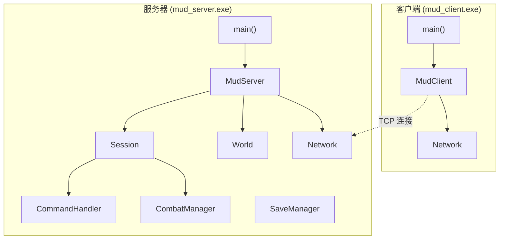
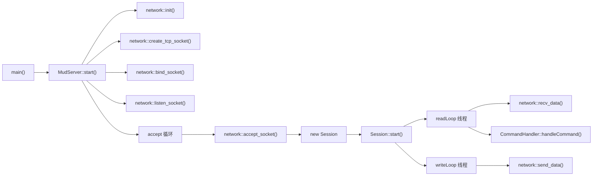
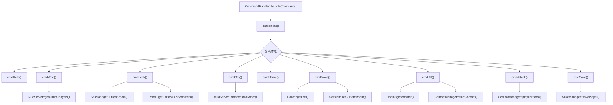
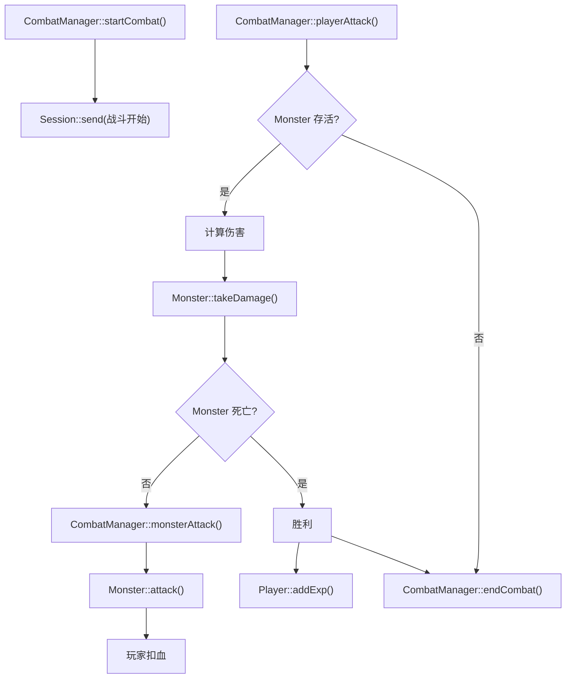
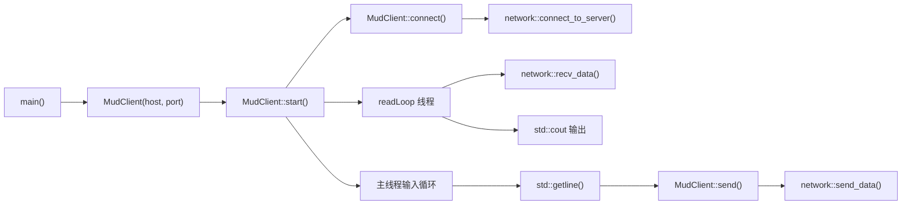
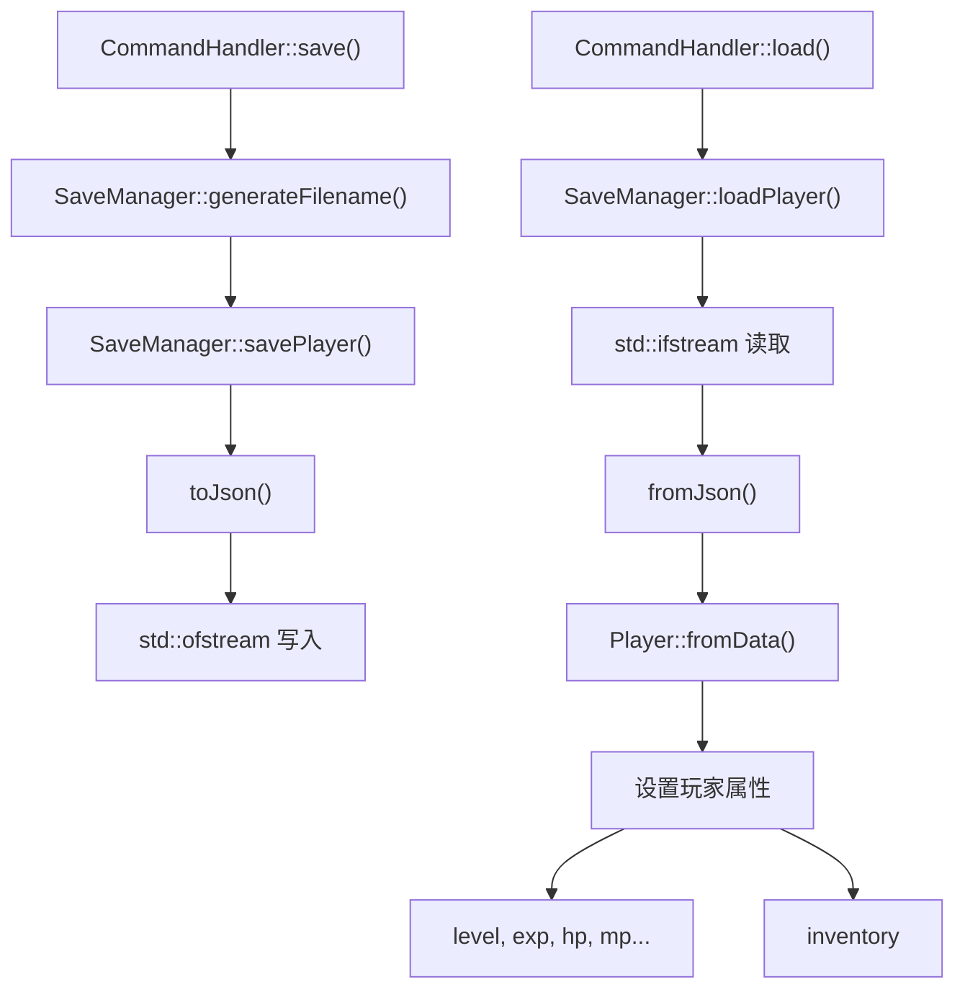
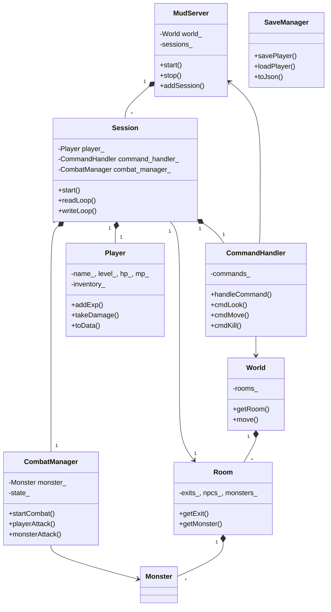
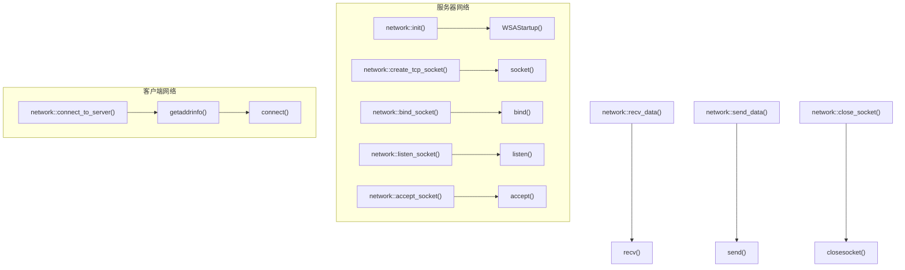

# MUD 游戏代码调用关系图

## 1. 模块架构图



---

## 2. 服务器核心调用关系



---

## 3. 命令处理调用关系



---

## 4. 战斗系统调用关系



---

## 5. 客户端调用关系



---

## 6. 存档系统调用关系



---

## 7. 类依赖关系



---

## 8. 网络层调用关系



---

## 9. 完整调用链路示例

### 玩家登录流程
```
main() 
  → MudServer::start() 
    → network::init/bind/listen() 
    → accept 循环 
      → Session::start() 
        → 发送欢迎消息
        → 启动 readLoop/writeLoop 线程
```

### 玩家移动流程
```
玩家输入 "north"
  → Session::readLoop() 
    → CommandHandler::handleCommand() 
      → cmdMove() 
        → Room::getExit(north) 
        → Session::setCurrentRoom() 
        → MudServer::broadcastToRoom()
```

### 战斗流程
```
玩家输入 "kill Goblin"
  → CommandHandler::cmdKill() 
    → Room::getMonster("Goblin") 
    → CombatManager::startCombat() 
      → Session::send(战斗开始)

玩家输入 "attack"
  → CommandHandler::cmdAttack() 
    → CombatManager::playerAttack() 
      → Monster::takeDamage() 
      → Monster::attack() (反击)
      → Session::send(战斗结果)
```
