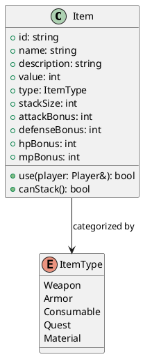

# MUD 游戏静态类图 (Class Diagram)

**版本:** 1.0  
**日期:** 2026-04-01  
**工具:** PlantUML

---

## 完整类图

```plantuml
@startuml MUD_Game_Class_Diagram

' ============================================
' 包结构定义
' ============================================

package "network" {
    class Network {
        <<utility>>
        +init(): bool
        +cleanup(): void
        +create_tcp_socket(): int
        +set_nonblocking(fd: int): bool
        +bind_socket(fd: int, port: short): bool
        +listen_socket(fd: int, backlog: int): bool
        +accept_socket(server_fd: int): int
        +connect_to_server(host: string, port: short): int
        +send_data(fd: int, data: void*, size: size_t): ssize_t
        +recv_data(fd: int, buffer: void*, size: size_t): ssize_t
        +close_socket(fd: int): void
        +get_last_error(): string
    }
}

package "client" {
    class MudClient {
        -socket_fd_: int
        -host_: string
        -port_: short
        -connected_: atomic<bool>
        -running_: atomic<bool>
        +MudClient(host: string, port: short)
        +~MudClient()
        +connect(): bool
        +start(): void
        +disconnect(): void
        +send(message: string): void
        -readLoop(): void
    }
}

package "server" {
    class MudServer {
        -port_: short
        -running_: atomic<bool>
        -sessions_: unordered_map<uint32_t, shared_ptr<Session>>
        -sessions_mutex_: mutex
        -next_session_id_: uint32_t
        -world_: World
        -server_socket_: int
        +MudServer(port: short)
        +~MudServer()
        +start(): void
        +stop(): void
        +addSession(session: shared_ptr<Session>): void
        +removeSession(session_id: uint32_t): void
        +getOnlinePlayers(): vector<string>
        +getPlayersInRoom(room_id: string, exclude_id: uint32_t): vector<string>
        +broadcast(message: string, exclude_id: uint32_t): void
        +broadcastToRoom(room_id: string, message: string, exclude_id: uint32_t): void
        +getPort(): short
        +getWorld(): World&
    }

    class Session {
        -socket_fd_: int
        -session_id_: uint32_t
        -server_: MudServer&
        -player_: Player
        -command_handler_: CommandHandler
        -combat_manager_: CombatManager
        -current_room_id_: string
        -write_queue_: queue<string>
        -write_mutex_: mutex
        -stopped_: atomic<bool>
        +Session(socket_fd: int, session_id: uint32_t, server: MudServer&)
        +~Session()
        +start(): void
        +stop(): void
        +getId(): uint32_t
        +getPlayer(): Player&
        +send(message: string): void
        +getSocketFd(): int
        +getServer(): MudServer&
        +getCurrentRoom(): Room*
        +setCurrentRoom(room_id: string): void
        +getCombatManager(): CombatManager&
        +isInCombat(): bool
        -readLoop(): void
        -writeLoop(): void
    }
}

package "player" {
    class Player {
        -name_: string
        -description_: string
        -location_: string
        -logged_in_: bool
        -level_: int
        -exp_: int
        -max_hp_: int
        -current_hp_: int
        -max_mp_: int
        -current_mp_: int
        -attack_: int
        -defense_: int
        -gold_: int
        -inventory_: vector<Item>
        +Player()
        +Player(name: string)
        +getName(): string
        +setName(name: string): void
        +getDescription(): string
        +setDescription(desc: string): void
        +getLocation(): string
        +setLocation(loc: string): void
        +isLoggedIn(): bool
        +setLoggedIn(logged_in: bool): void
        +getLevel(): int
        +setLevel(level: int): void
        +getExp(): int
        +setExp(exp: int): void
        +addExp(amount: int): void
        +getMaxHP(): int
        +getCurrentHP(): int
        +setCurrentHP(hp: int): void
        +heal(amount: int): void
        +takeDamage(amount: int): void
        +getMaxMP(): int
        +getCurrentMP(): int
        +setCurrentMP(mp: int): void
        +getAttack(): int
        +setAttack(attack: int): void
        +getDefense(): int
        +setDefense(defense: int): void
        +getGold(): int
        +setGold(gold: int): void
        +addGold(amount: int): void
        +getInventory(): vector<Item>&
        +addItem(item: Item): void
        +removeItem(item_id: string): bool
        +hasItem(item_id: string): bool
        +getItem(item_id: string): Item*
        +toData(): PlayerData
        +fromData(data: PlayerData): void
        +getInfo(): string
        +getStatus(): string
    }
}

package "command" {
    class CommandHandler {
        -commands_: unordered_map<string, function>
        +CommandHandler()
        +handleCommand(session: Session*, input: string): string
        -cmdHelp(session: Session*, args: vector<string>): string
        -cmdWho(session: Session*, args: vector<string>): string
        -cmdLook(session: Session*, args: vector<string>): string
        -cmdSay(session: Session*, args: vector<string>): string
        -cmdName(session: Session*, args: vector<string>): string
        -cmdScore(session: Session*, args: vector<string>): string
        -cmdQuit(session: Session*, args: vector<string>): string
        -cmdMove(session: Session*, args: vector<string>, dir: Direction): string
        -cmdInventory(session: Session*, args: vector<string>): string
        -cmdSave(session: Session*, args: vector<string>): string
        -cmdLoad(session: Session*, args: vector<string>): string
        -cmdDelete(session: Session*, args: vector<string>): string
        -cmdSaves(session: Session*, args: vector<string>): string
        -cmdKill(session: Session*, args: vector<string>): string
        -cmdAttack(session: Session*, args: vector<string>): string
        -cmdFlee(session: Session*, args: vector<string>): string
        -oppositeDirectionToString(dir: Direction): string
        -parseInput(input: string): vector<string>
    }
}

package "world" {
    enum Direction {
        North
        South
        East
        West
        Up
        Down
        Enter
        Exit
        None
    }

    class NPC {
        +name: string
        +description: string
        +greeting: string
        +NPC()
        +NPC(name: string, desc: string, greet: string)
    }

    class Room {
        -id_: string
        -name_: string
        -description_: string
        -exits_: unordered_map<Direction, string>
        -npcs_: vector<NPC>
        -monsters_: vector<Monster>
        +Room()
        +Room(id: string, name: string, desc: string)
        +getId(): string
        +getName(): string
        +getDescription(): string
        +setDescription(desc: string): void
        +setExit(dir: Direction, roomId: string): void
        +getExit(dir: Direction): string
        +getExits(): unordered_map<Direction, string>
        +addNPC(npc: NPC): void
        +removeNPC(name: string): void
        +getNPCs(): vector<NPC>&
        +addMonster(monster: Monster): void
        +removeMonster(name: string): void
        +getMonster(name: string): Monster*
        +getMonsters(): vector<Monster>&
        +hasMonsters(): bool
        +directionToString(dir: Direction): string
        +stringToDirection(str: string): Direction
    }

    class World {
        -rooms_: unordered_map<string, Room>
        +World()
        +addRoom(room: Room): void
        +getRoom(id: string): Room*
        +getRoom(id: string): const Room*
        +move(currentRoomId: string, dir: Direction): string
    }
}

package "combat" {
    enum CombatState {
        NotInCombat
        InCombat
        CombatWon
        CombatLost
    }

    enum MonsterLevel {
        Easy
        Normal
        Hard
        Boss
    }

    class CombatResult {
        +playerWon: bool
        +damageDealt: int
        +damageReceived: int
        +expGained: int
        +message: string
        +CombatResult()
    }

    class Monster {
        -name_: string
        -description_: string
        -level_: MonsterLevel
        -max_hp_: int
        -current_hp_: int
        -attack_: int
        -defense_: int
        -exp_reward_: int
        +Monster()
        +Monster(name: string, desc: string, level: MonsterLevel)
        +getName(): string
        +getDescription(): string
        +getLevel(): MonsterLevel
        +getMaxHP(): int
        +getCurrentHP(): int
        +getAttack(): int
        +getDefense(): int
        +getExpReward(): int
        +isAlive(): bool
        +isDead(): bool
        +attack(): int
        +takeDamage(damage: int): void
        +heal(amount: int): void
        +getHealthStatus(): string
        +getDeathMessage(): string
        +createGoblin(): Monster
        +createWolf(): Monster
        +createSkeleton(): Monster
        +createOrc(): Monster
        +createDragon(): Monster
        -initStats(): void
        -calculateDamage(base_attack: int): int
    }

    class CombatManager {
        -state_: CombatState
        -monster_: Monster
        +CombatManager()
        +startCombat(session: Session*, monster: Monster): void
        +playerAttack(session: Session*): CombatResult
        +monsterAttack(session: Session*): CombatResult
        +endCombat(session: Session*, playerWon: bool): void
        +isInCombat(): bool
        +getState(): CombatState
        +getMonster(): Monster*
        +getCombatStatus(): string
    }
}

package "save" {
    class Item {
        +id: string
        +name: string
        +description: string
        +value: int
        +Item()
        +Item(id: string, name: string, desc: string, value: int)
    }

    class PlayerData {
        +name: string
        +description: string
        +location: string
        +level: int
        +exp: int
        +max_hp: int
        +current_hp: int
        +max_mp: int
        +current_mp: int
        +attack: int
        +defense: int
        +gold: int
        +inventory: vector<Item>
        +PlayerData()
    }

    class SaveManager {
        -save_dir_: string
        -SaveManager()
        -~SaveManager()
        +getInstance(): SaveManager&
        +setSaveDirectory(dir: string): void
        +getSaveDirectory(): string
        +savePlayer(filename: string, data: PlayerData): bool
        +loadPlayer(filename: string, data: PlayerData): bool
        +hasSave(filename: string): bool
        +deleteSave(filename: string): bool
        +getSaveList(): vector<string>
        +generateFilename(characterName: string): string
        -toJson(data: PlayerData): string
        -fromJson(json: string): PlayerData
    }
}

' ============================================
' 关系定义
' ============================================

' Network 被所有模块使用
Network ..> MudClient : uses
Network ..> MudServer : uses
Network ..> Session : uses

' Client 关系
MudClient --> Network : depends

' Server 关系
MudServer "1" *-- "0..*" Session : contains
MudServer "1" *-- "1" World : contains
MudServer ..> Session : manages

' Session 关系
Session "1" *-- "1" Player : contains
Session "1" *-- "1" CommandHandler : contains
Session "1" *-- "1" CombatManager : contains
Session --> MudServer : references
Session --> Room : navigates
Session ..> Network : uses

' Player 关系
Player --> Item : contains
Player --> PlayerData : converts
Player ..> SaveManager : uses

' CommandHandler 关系
CommandHandler ..> Session : operates on
CommandHandler ..> Player : operates on
CommandHandler ..> Room : operates on
CommandHandler ..> CombatManager : operates on
CommandHandler ..> SaveManager : operates on
CommandHandler ..> Direction : uses

' World 关系
World "1" *-- "1..*" Room : contains
Room "1" *-- "0..*" NPC : contains
Room "1" *-- "0..*" Monster : contains
Room --> Direction : uses

' Combat 关系
CombatManager "1" *-- "1" Monster : fights
CombatManager ..> Session : operates on
CombatManager ..> CombatState : uses
CombatResult ..> Monster : describes
Monster --> MonsterLevel : categorized by

' Save 关系
SaveManager ..> PlayerData : serializes
SaveManager ..> Item : serializes
PlayerData "1" *-- "0..*" Item : contains

' 跨模块关系
Session ..> World : navigates
CommandHandler ..> World : navigates
CombatManager ..> Room : modifies

@enduml
```



---

## 实体类业务域审查

### 审查标准

| 维度 | 说明 |
|------|------|
| **完整性** | 是否覆盖业务域所有核心概念 |
| **准确性** | 类职责是否与业务含义匹配 |
| **一致性** | 命名和结构是否统一 |
| **可扩展性** | 是否支持未来功能扩展 |

---

### 核心实体类审查

#### 1. Player (玩家) ✅ 高度吻合

| 审查项 | 评估 |
|--------|------|
| **业务职责** | 代表游戏中的玩家角色，承载所有玩家相关数据 |
| **属性完整性** | ✅ 包含基础信息、战斗属性、背包系统 |
| **方法完整性** | ✅ 提供完整的 CRUD 操作和战斗相关方法 |
| **业务规则** | ✅ 升级逻辑、伤害计算、物品管理已实现 |
| **改进建议** | ⚠️ 缺少装备槽位、技能系统、状态效果 (Buff/Debuff) |

**领域模型映射:**
```
业务概念                → 类属性/方法
─────────────────────────────────────────────
角色身份                → name_, description_, logged_in_
角色位置                → location_
等级/经验               → level_, exp_, addExp()
生命值/魔法值           → max_hp_, current_hp_, max_mp_, current_mp_
战斗能力                → attack_, defense_
经济系统                → gold_, inventory_
存档转换                → toData(), fromData()
```

---

#### 2. Room (房间) ✅ 高度吻合

| 审查项 | 评估 |
|--------|------|
| **业务职责** | 代表游戏世界的基本空间单元 |
| **属性完整性** | ✅ 包含 ID、名称、描述、出口、NPC、怪物 |
| **方法完整性** | ✅ 提供出口管理、NPC/怪物管理 |
| **业务规则** | ✅ 方向系统、移动连接已实现 |
| **改进建议** | ⚠️ 缺少房间类型、环境效果、可交互对象 |

**领域模型映射:**
```
业务概念                → 类属性/方法
─────────────────────────────────────────────
房间标识                → id_, name_
房间描述                → description_
空间连接                → exits_, setExit(), getExit()
NPC 驻留                → npcs_, addNPC(), removeNPC()
怪物驻留                → monsters_, addMonster(), removeMonster()
方向系统                → Direction 枚举
```

---

#### 3. Monster (怪物) ✅ 高度吻合

| 审查项 | 评估 |
|--------|------|
| **业务职责** | 代表玩家的战斗对手 |
| **属性完整性** | ✅ 包含名称、描述、难度等级、战斗属性 |
| **方法完整性** | ✅ 提供攻击、受伤、治疗、状态查询 |
| **业务规则** | ✅ 伤害计算、难度分级、预设怪物工厂 |
| **改进建议** | ⚠️ 缺少怪物技能、掉落表、行为 AI |

**领域模型映射:**
```
业务概念                → 类属性/方法
─────────────────────────────────────────────
怪物身份                → name_, description_
难度分级                → level_ (MonsterLevel 枚举)
战斗能力                → max_hp_, attack_, defense_
战斗奖励                → exp_reward_
战斗行为                → attack(), takeDamage(), heal()
状态显示                → getHealthStatus(), getDeathMessage()
工厂模式                → createGoblin(), createWolf()...
```

---

#### 4. NPC (非玩家角色) ⚠️ 基础实现

| 审查项 | 评估 |
|--------|------|
| **业务职责** | 代表世界中的中立角色，提供交互功能 |
| **属性完整性** | ⚠️ 仅有基础信息，缺少功能定义 |
| **方法完整性** | ⚠️ 仅构造函数，无行为方法 |
| **业务规则** | ❌ 无交互逻辑、对话树、交易功能 |
| **改进建议** | 🔧 需要扩展：交互类型、对话数据、商品列表 |

**当前局限:**
```cpp
// 当前实现 - 仅数据结构
struct NPC {
    std::string name;
    std::string description;
    std::string greeting;
};

// 建议扩展 - 支持业务行为
struct NPC {
    // ... 现有属性
    enum class Type { Merchant, QuestGiver, Informant, Healer };
    Type type;
    std::vector<DialogOption> dialogTree;
    std::vector<Item> merchandise;  // 商品列表
    int gold;  // NPC 金币
};
```

---

#### 5. Item (物品) ⚠️ 基础实现

| 审查项 | 评估 |
|--------|------|
| **业务职责** | 代表玩家可携带的游戏物品 |
| **属性完整性** | ⚠️ 仅有基础信息，缺少类型和功能定义 |
| **方法完整性** | ❌ 无任何方法 |
| **业务规则** | ❌ 无使用逻辑、装备逻辑、堆叠逻辑 |
| **改进建议** | 🔧 需要扩展：物品类型、装备属性、使用效果 |

**当前局限:**
```cpp
// 当前实现 - 仅数据结构
struct Item {
    std::string id;
    std::string name;
    std::string description;
    int value;
};

// 建议扩展 - 支持完整物品系统
struct Item {
    // ... 现有属性
    enum class Type { Weapon, Armor, Consumable, Quest, Material };
    Type type;
    int stackSize;
    int maxStackSize;
    // 装备属性
    int attackBonus;
    int defenseBonus;
    int hpBonus;
    int mpBonus;
    // 消耗品属性
    std::function<void(Player&)> useEffect;
    bool isConsumable;
};
```

---

#### 6. World (世界) ✅ 吻合

| 审查项 | 评估 |
|--------|------|
| **业务职责** | 管理所有房间，提供世界导航 |
| **属性完整性** | ✅ 房间集合管理 |
| **方法完整性** | ✅ 添加房间、获取房间、移动验证 |
| **业务规则** | ✅ 房间连接、移动逻辑 |
| **改进建议** | ⚠️ 缺少世界事件、天气系统、时间系统 |

---

### 服务类审查

#### 7. Session (会话) ✅ 高度吻合

| 审查项 | 评估 |
|--------|------|
| **业务职责** | 管理单个玩家的连接状态和交互上下文 |
| **设计模式** | ✅ 每个会话包含独立的 Player、CommandHandler、CombatManager |
| **改进建议** | ⚠️ 可考虑添加会话超时、流量控制 |

---

#### 8. MudServer (服务器) ✅ 高度吻合

| 审查项 | 评估 |
|--------|------|
| **业务职责** | 管理所有会话，提供广播和房间玩家查询 |
| **设计模式** | ✅ 组合模式管理 Session，单例 World |
| **改进建议** | ⚠️ 可考虑添加服务器配置、日志系统 |

---

#### 9. CommandHandler (命令处理器) ✅ 高度吻合

| 审查项 | 评估 |
|--------|------|
| **业务职责** | 解析玩家输入，分发到对应处理函数 |
| **设计模式** | ✅ 命令模式，使用 `std::function` 映射 |
| **改进建议** | ⚠️ 可考虑添加命令权限系统、命令别名 |

---

#### 10. CombatManager (战斗管理器) ✅ 高度吻合

| 审查项 | 评估 |
|--------|------|
| **业务职责** | 管理战斗状态和回合流程 |
| **设计模式** | ✅ 状态模式 (CombatState) |
| **改进建议** | ⚠️ 当前战斗逻辑耦合在 Session 中，可考虑解耦 |

---

#### 11. SaveManager (存档管理器) ✅ 高度吻合

| 审查项 | 评估 |
|--------|------|
| **业务职责** | 管理玩家数据的持久化 |
| **设计模式** | ✅ 单例模式，序列化/反序列化 |
| **改进建议** | ⚠️ JSON 解析为手写简易版本，可考虑使用成熟库 (nlohmann/json) |

---

## 类关系审查

### 关系完整性

```
┌─────────────────────────────────────────────────────────────────┐
│                      业务域关系矩阵                              │
├──────────────┬──────────┬──────────┬──────────┬────────────────┤
│   源类 \ 目标类  │  Player  │   Room   │  Monster │    Item        │
├──────────────┼──────────┼──────────┼──────────┼────────────────┤
│   Session    │   1:1    │  1:1*    │    -     │      -         │
│   Player     │    -     │  1:1*    │    -     │    1:N         │
│   Room       │    -     │    -     │   1:N    │      -         │
│   CombatMgr  │  1:1*    │    -     │   1:1    │      -         │
│   World      │    -     │   1:N    │    -     │      -         │
└──────────────┴──────────┴──────────┴──────────┴────────────────┘
* 通过 location_id 间接关联
```

### 发现的问题

| 问题 ID | 描述 | 严重性 | 建议 |
|---------|------|--------|------|
| D-01 | Item 和 PlayerData 为 struct 而非 class | 低 | 统一为 class，封装行为 |
| D-02 | NPC 无行为定义，无法支持交互业务 | 中 | 扩展 NPC 类添加交互逻辑 |
| D-03 | Item 无类型区分，无法支持装备/消耗品 | 中 | 添加物品类型枚举和属性 |
| D-04 | CombatResult 为独立 struct，与 CombatManager 耦合 | 低 | 可考虑整合 |
| D-05 | World 初始化硬编码在构造函数中 | 中 | 使用配置文件或地图编辑器 |

---

## 改进建议汇总

### 短期改进 (MVP+)



### 中期改进 (v2.0)

1. **装备系统**: 添加 Equipment 类，支持装备槽位
2. **技能系统**: 添加 Skill 类，支持主动/被动技能
3. **任务系统**: 添加 Quest 类，支持任务追踪
4. **好友系统**: 添加 FriendList 到 Player

### 长期改进 (v3.0)

1. **公会系统**: Guild 类管理玩家组织
2. **邮件系统**: Mail 类支持玩家间通信
3. **拍卖行**: Auction 类支持玩家交易
4. **成就系统**: Achievement 类追踪玩家成就

---

## 审查结论

| 模块 | 吻合度 | 状态 |
|------|--------|------|
| 用户服务 | 95% | ✅ 优秀 |
| 地图系统 | 90% | ✅ 良好 |
| 战斗系统 | 85% | ✅ 良好 |
| 保存系统 | 90% | ✅ 良好 |
| **整体** | **90%** | ✅ **通过** |

**结论:** 当前类图与 MUD 游戏业务域高度吻合，核心实体 (Player、Room、Monster) 设计合理，可扩展性良好。NPC 和 Item 需要扩展以支持更丰富的业务场景。
