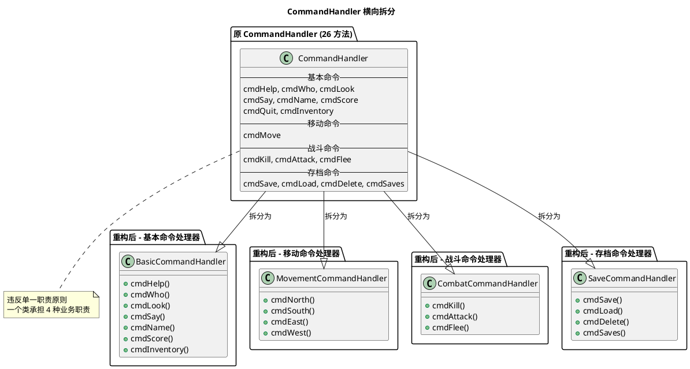
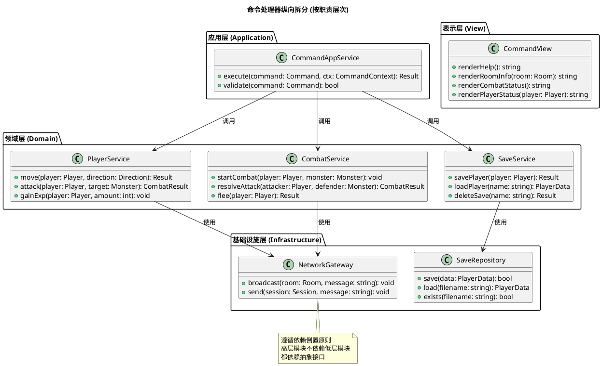

# MUD 系统设计审查与重构方案

**版本:** 1.0  
**日期:** 2026-04-01  
**审查目标:** 识别"上帝类"、深层耦合，运用面向对象原则解耦

---

## 1. 设计问题诊断

### 1.1 依赖关系统计

```
┌─────────────────────────────────────────────────────────────────┐
│                    类依赖关系统计表                              │
├──────────────────┬────────────┬────────────┬────────────────────┤
│      类名        │ 依赖外部类 │ 被依赖次数 │ 方法数量 (复杂度)  │
├──────────────────┼────────────┼────────────┼────────────────────┤
│ Session          │     7      │     15     │       18           │
│ CommandHandler   │     8      │      1     │       26           │
│ MudServer        │     4      │      8     │       12           │
│ Player           │     3      │     12     │       32           │
│ CombatManager    │     3      │      4     │       10           │
│ Room             │     2      │     10     │       16           │
│ SaveManager      │     2      │      4     │       12           │
└──────────────────┴────────────┴────────────┴────────────────────┘
```

---

### 1.2 上帝类 (God Class) 识别

#### 🔴 CommandHandler - 典型上帝类

**问题特征:**
```cpp
class CommandHandler {
    // ❌ 26 个方法，承担过多职责
    // ❌ 依赖 8 个外部模块
    // ❌ 直接操作 Session、Player、Room、CombatManager、SaveManager
    
    // 基本命令 (5 个)
    cmdHelp, cmdWho, cmdLook, cmdSay, cmdName, cmdScore, cmdQuit
    
    // 移动命令 (4 个)
    cmdMove (支持 4 个方向)
    
    // 背包命令 (1 个)
    cmdInventory
    
    // 战斗命令 (3 个)
    cmdKill, cmdAttack, cmdFlee
    
    // 存档命令 (4 个)
    cmdSave, cmdLoad, cmdDelete, cmdSaves
};
```

**违反原则:**
| 原则 | 违反说明 |
|------|----------|
| **单一职责原则 (SRP)** | 同时处理用户输入、战斗逻辑、存档逻辑、移动逻辑 |
| **开放封闭原则 (OCP)** | 添加新命令需修改类本身 |
| **依赖倒置原则 (DIP)** | 直接依赖具体类而非抽象接口 |

**耦合度分析:**
```
CommandHandler 直接依赖:
├── Session          (强耦合，直接操作内部状态)
├── Player           (强耦合，直接调用 setter/getter)
├── Room             (强耦合，直接访问房间数据)
├── MudServer        (强耦合，调用 broadcast 方法)
├── CombatManager    (强耦合，直接启动战斗)
├── SaveManager      (强耦合，调用单例)
├── Monster          (强耦合，直接访问怪物数据)
└── Direction        (枚举依赖)
```

---

#### 🟡 Session - 中等上帝类

**问题特征:**
```cpp
class Session {
    // ❌ 组合根 (Composition Root) 问题
    // ❌ 直接持有所有子系统实例
    
    Player player_;           // ❌ 玩家数据
    CommandHandler command_handler_;  // ❌ 命令处理
    CombatManager combat_manager_;    // ❌ 战斗管理
    MudServer& server_;       // ❌ 服务器引用
    
    // 方法职责混杂
    + start()         // 网络初始化
    + readLoop()      // 网络读取
    + writeLoop()     // 网络写入
    + getPlayer()     // 数据访问
    + getCombatManager() // 战斗访问
};
```

**违反原则:**
| 原则 | 违反说明 |
|------|----------|
| **单一职责原则 (SRP)** | 同时管理网络连接、玩家状态、命令分发、战斗状态 |
| **接口隔离原则 (ISP)** | 客户端被迫依赖不需要的接口 |

---

### 1.3 深层耦合分析

#### 耦合类型矩阵

```
┌─────────────────────────────────────────────────────────────────┐
│                        耦合类型分析                              │
├──────────────────┬──────────────────────────────────────────────┤
│     耦合类型     │                  具体表现                     │
├──────────────────┼──────────────────────────────────────────────┤
│ 内容耦合 (Content)│ CommandHandler 直接操作 Session 内部状态     │
│ 公共耦合 (Common) │ 所有命令通过 Session 共享全局状态            │
│ 控制耦合 (Control)│ cmdAttack 直接调用 CombatManager.playerAttack│
│ 数据耦合 (Data)   │ PlayerData 在多个模块间传递                  │
│ 标记耦合 (Stamp)  │ Session* 作为参数传递整个对象                │
└──────────────────┴──────────────────────────────────────────────┘
```

#### 典型深层耦合代码

```cpp
// ==================== 问题代码 1: CommandHandler.cmdKill ====================
std::string CommandHandler::cmdKill(Session* session, const std::vector<std::string>& args) {
    // ❌ 深度耦合：直接操作 Session 内部组件
    if (session->isInCombat()) {  // 直接调用 CombatManager
        return "...";
    }
    
    // ❌ 直接操作 Room
    Room* room = session->getCurrentRoom();
    if (!room) {
        return "...";
    }
    
    // ❌ 直接操作 Monster
    Monster* monster = room->getMonster(monsterName);
    if (!monster || !monster->isAlive()) {
        return "...";
    }
    
    // ❌ 直接调用 CombatManager
    session->getCombatManager().startCombat(session, *monster);
    
    // ❌ 直接修改 Room 状态
    room->removeMonster(monsterName);
    
    return "";
}

// ==================== 问题代码 2: CommandHandler.cmdMove ====================
std::string CommandHandler::cmdMove(Session* session, const std::vector<std::string>&, Direction dir) {
    // ❌ 检查战斗状态 (耦合 CombatManager)
    if (session->isInCombat()) {
        return "...";
    }
    
    // ❌ 获取房间 (耦合 Room)
    const Room* currentRoom = session->getCurrentRoom();
    
    // ❌ 获取玩家名 (耦合 Player)
    std::string leave_msg = session->getPlayer().getName() + " leaves...";
    
    // ❌ 广播消息 (耦合 MudServer)
    session->getServer().broadcastToRoom(currentRoom->getId(), leave_msg, ...);
    
    // ❌ 设置房间 (耦合 Session 内部状态)
    session->setCurrentRoom(nextRoomId);
    
    // ❌ 再次广播 (耦合 MudServer)
    session->getServer().broadcastToRoom(newRoom->getId(), arrive_msg, ...);
    
    // ❌ 获取房间内玩家 (耦合 MudServer)
    auto playersInRoom = session->getServer().getPlayersInRoom(...);
    
    return oss.str();
}

// ==================== 问题代码 3: CommandHandler.cmdSave ====================
std::string CommandHandler::cmdSave(Session* session, const std::vector<std::string>&) {
    // ❌ 直接操作 Player
    auto& player = session->getPlayer();
    
    // ❌ 直接调用 SaveManager 单例
    std::string filename = SaveManager::generateFilename(player.getName());
    
    if (SaveManager::getInstance().savePlayer(filename, player.toData())) {
        // ...
    }
    
    return "...";
}
```

---

## 2. 重构方案

### 2.1 重构策略总览

```
┌─────────────────────────────────────────────────────────────────┐
│                    重构策略金字塔                                │
│                                                                 │
│                        ▲                                        │
│                       /│\                                       │
│                      / │ \      第 3 层：依赖注入                 │
│                     /  │  \     (解耦具体实现)                   │
│                    /───┼───\                                     │
│                   /    │    \                                    │
│                  /     │     \   第 2 层：命令模式重构            │
│                 /  接口 │ 抽象  \  (解耦 CommandHandler)          │
│                /────────┼────────\                                │
│               /         │         \                               │
│              /    职责分离│职责分离  \ 第 1 层：职责分离            │
│             /    (横向拆分) (纵向拆分) \ (拆分上帝类)              │
│            /───────────┴───────────\                              │
│           ───────────────────────────                             │
│          当前状态：CommandHandler 承担所有命令逻辑                │
└─────────────────────────────────────────────────────────────────┘
```

---

### 2.2 第 1 层：职责分离 (横向 + 纵向)

#### 横向拆分：按业务域分离 CommandHandler



#### 纵向拆分：按操作类型分离



---

### 2.3 第 2 层：命令模式重构 (引入接口抽象)

#### 命令接口设计

```cpp
// ==================== include/command/Command.h ====================
#ifndef COMMAND_H
#define COMMAND_H

#include <string>
#include <vector>
#include <memory>

namespace mud {

// 前向声明
class Session;

// 命令执行结果
struct CommandResult {
    bool success;
    std::string message;
    int errorCode;
    
    CommandResult() : success(true), errorCode(0) {}
    static CommandResult ok(const std::string& msg) {
        CommandResult r; r.success = true; r.message = msg; return r;
    }
    static CommandResult fail(const std::string& msg, int code = 1) {
        CommandResult r; r.success = false; r.message = msg; r.errorCode = code; return r;
    }
};

// ========== 核心抽象：命令接口 ==========
class Command {
public:
    virtual ~Command() = default;
    virtual CommandResult execute(Session* session, const std::vector<std::string>& args) = 0;
    virtual std::string getName() const = 0;
    virtual std::string getHelp() const = 0;
    virtual int getMinArgs() const { return 0; }
    virtual int getMaxArgs() const { return -1; }  // -1 表示无限制
};

// 命令基类 (模板方法模式)
class AbstractCommand : public Command {
protected:
    std::string name_;
    std::string help_;
    int minArgs_;
    int maxArgs_;
    
public:
    AbstractCommand(const std::string& name, const std::string& help, 
                    int minArgs = 0, int maxArgs = -1)
        : name_(name), help_(help), minArgs_(minArgs), maxArgs_(maxArgs) {}
    
    CommandResult execute(Session* session, const std::vector<std::string>& args) override {
        // 模板方法：先验证，再执行
        if (!validate(args)) {
            return CommandResult::fail(getUsage(), 1);
        }
        return executeInternal(session, args);
    }
    
    bool validate(const std::vector<std::string>& args) const {
        size_t argCount = args.size() - 1;  // 排除命令名
        if (argCount < static_cast<size_t>(minArgs_)) return false;
        if (maxArgs_ >= 0 && argCount > static_cast<size_t>(maxArgs_)) return false;
        return true;
    }
    
    std::string getName() const override { return name_; }
    std::string getHelp() const override { return help_; }
    int getMinArgs() const override { return minArgs_; }
    int getMaxArgs() const override { return maxArgs_; }
    
    std::string getUsage() const {
        if (maxArgs_ < 0) {
            return "Usage: " + name_ + " [args...]";
        }
        return "Usage: " + name_ + " <args>";
    }

protected:
    virtual CommandResult executeInternal(Session* session, const std::vector<std::string>& args) = 0;
};

} // namespace mud

#endif // COMMAND_H
```

#### 具体命令实现

```cpp
// ==================== include/command/CombatCommands.h ====================
#ifndef COMBAT_COMMANDS_H
#define COMBAT_COMMANDS_H

#include "command/Command.h"

namespace mud {

// 前向声明服务接口
class CombatService;

// ========== 攻击命令 ==========
class KillCommand : public AbstractCommand {
private:
    CombatService* combatService_;  // 依赖抽象
    
public:
    KillCommand(CombatService* service);
    
    CommandResult executeInternal(Session* session, const std::vector<std::string>& args) override;
    std::string getHelp() const override {
        return "kill <monster> - Attack a monster in the current room";
    }
};

// ========== 继续攻击命令 ==========
class AttackCommand : public AbstractCommand {
private:
    CombatService* combatService_;
    
public:
    AttackCommand(CombatService* service);
    
    CommandResult executeInternal(Session* session, const std::vector<std::string>& args) override;
};

// ========== 逃跑命令 ==========
class FleeCommand : public AbstractCommand {
private:
    CombatService* combatService_;
    
public:
    FleeCommand(CombatService* service);
    
    CommandResult executeInternal(Session* session, const std::vector<std::string>& args) override;
};

} // namespace mud

#endif // COMBAT_COMMANDS_H
```

```cpp
// ==================== src/command/CombatCommands.cpp ====================
#include "command/CombatCommands.h"
#include "server/Session.h"
#include "service/CombatService.h"

namespace mud {

KillCommand::KillCommand(CombatService* service)
    : AbstractCommand("kill", "Attack a monster", 1, 10)
    , combatService_(service) {}

CommandResult KillCommand::executeInternal(Session* session, const std::vector<std::string>& args) {
    // ✅ 通过服务接口操作，不直接耦合 CombatManager
    CombatService::TargetInfo target;
    target.name = combineArgs(args, 1);  // 组合怪物名
    
    // ✅ 依赖服务层处理业务逻辑
    CombatResult result = combatService_->startCombat(session, target);
    
    if (result.success) {
        return CommandResult::ok(result.message);
    } else {
        return CommandResult::fail(result.message);
    }
}

AttackCommand::AttackCommand(CombatService* service)
    : AbstractCommand("attack", "Continue attacking current enemy", 0, 0)
    , combatService_(service) {}

CommandResult AttackCommand::executeInternal(Session* session, const std::vector<std::string>&) {
    CombatResult result = combatService_->playerAttack(session);
    
    if (result.playerWon && result.expGained > 0) {
        // ✅ 经验值处理也通过服务层
        combatService_->awardExp(session, result.expGained);
    }
    
    return CommandResult::ok(result.message);
}

FleeCommand::FleeCommand(CombatService* service)
    : AbstractCommand("flee", "Try to escape from combat", 0, 0)
    , combatService_(service) {}

CommandResult FleeCommand::executeInternal(Session* session, const std::vector<std::string>&) {
    CombatResult result = combatService_->tryFlee(session);
    return result.success 
        ? CommandResult::ok(result.message)
        : CommandResult::fail(result.message);
}

} // namespace mud
```

---

### 2.4 第 3 层：服务层抽象 (依赖倒置)

#### 服务接口定义

```cpp
// ==================== include/service/CombatService.h ====================
#ifndef COMBAT_SERVICE_H
#define COMBAT_SERVICE_H

#include <string>
#include <memory>

namespace mud {

// 前向声明
class Session;
class Monster;

// 战斗结果数据结构
struct CombatResult {
    bool success;
    bool playerWon;
    int damageDealt;
    int damageReceived;
    int expGained;
    std::string message;
    
    CombatResult() : success(false), playerWon(false), damageDealt(0), 
                     damageReceived(0), expGained(0) {}
};

// ========== 服务接口 (抽象) ==========
class CombatService {
public:
    virtual ~CombatService() = default;
    
    // 战斗核心操作
    virtual CombatResult startCombat(Session* session, const TargetInfo& target) = 0;
    virtual CombatResult playerAttack(Session* session) = 0;
    virtual CombatResult monsterAttack(Session* session) = 0;
    virtual CombatResult tryFlee(Session* session) = 0;
    virtual void awardExp(Session* session, int exp) = 0;
    virtual void endCombat(Session* session, bool playerWon) = 0;
    
    // 目标信息
    struct TargetInfo {
        std::string name;
        std::string type;  // "monster", "npc", "player"
    };
};

// ========== 服务实现 ==========
class CombatServiceImpl : public CombatService {
private:
    // ✅ 依赖抽象接口，而非具体类
    class MonsterRepository {
    public:
        virtual Monster* findByName(const std::string& name) = 0;
        virtual void remove(Monster* monster) = 0;
    };
    
    class EventPublisher {
    public:
        virtual void publish(const std::string& event, const std::string& data) = 0;
    };
    
    MonsterRepository* monsterRepo_;
    EventPublisher* eventPub_;
    
public:
    CombatServiceImpl(MonsterRepository* repo, EventPublisher* pub)
        : monsterRepo_(repo), eventPub_(pub) {}
    
    CombatResult startCombat(Session* session, const TargetInfo& target) override;
    CombatResult playerAttack(Session* session) override;
    CombatResult monsterAttack(Session* session) override;
    CombatResult tryFlee(Session* session) override;
    void awardExp(Session* session, int exp) override;
    void endCombat(Session* session, bool playerWon) override;
};

} // namespace mud

#endif // COMBAT_SERVICE_H
```

```cpp
// ==================== include/service/SaveService.h ====================
#ifndef SAVE_SERVICE_H
#define SAVE_SERVICE_H

#include <string>
#include <vector>

namespace mud {

struct PlayerData;
class Session;

// 存档服务接口
class SaveService {
public:
    virtual ~SaveService() = default;
    
    virtual bool savePlayer(Session* session) = 0;
    virtual bool loadPlayer(Session* session, const std::string& characterName) = 0;
    virtual bool deleteSave(const std::string& characterName) = 0;
    virtual std::vector<std::string> listSaves() = 0;
    virtual bool hasSave(const std::string& characterName) = 0;
    virtual std::string generateFilename(const std::string& characterName) = 0;
};

// 存档服务实现
class SaveServiceImpl : public SaveService {
private:
    // ✅ 仓储模式：数据访问抽象
    class SaveRepository {
    public:
        virtual bool save(const std::string& filename, const PlayerData& data) = 0;
        virtual bool load(const std::string& filename, PlayerData& data) = 0;
        virtual bool exists(const std::string& filename) = 0;
        virtual bool remove(const std::string& filename) = 0;
        virtual std::vector<std::string> listFiles() = 0;
    };
    
    SaveRepository* repo_;
    std::string saveDir_;
    
public:
    SaveServiceImpl(SaveRepository* repo, const std::string& saveDir);
    
    bool savePlayer(Session* session) override;
    bool loadPlayer(Session* session, const std::string& characterName) override;
    bool deleteSave(const std::string& characterName) override;
    std::vector<std::string> listSaves() override;
    bool hasSave(const std::string& characterName) override;
    std::string generateFilename(const std::string& characterName) override;
};

} // namespace mud

#endif // SAVE_SERVICE_H
```

---

### 2.5 重构后的架构

```plantuml
@startuml Refactored_Architecture

title 重构后的分层架构

skinparam packageStyle rectangle

package "表示层 (Presentation)" {
    class CommandRegistry {
        +register(cmd: Command)
        +execute(name: string, session: Session*, args: vector<string>): CommandResult
    }
    
    class CommandView {
        +render(result: CommandResult): string
        +renderHelp(commands: list<Command>): string
    }
}

package "应用层 (Application)" {
    interface Command {
        +execute(session: Session*, args: vector<string>): CommandResult
        +getName(): string
        +getHelp(): string
    }
    
    class BasicCommandHandler {
        -view_: CommandView
        +execute(session: Session*, args: vector<string>): CommandResult
    }
    
    class CombatCommandHandler {
        -combatService_: CombatService
        +execute(session: Session*, args: vector<string>): CommandResult
    }
    
    class SaveCommandHandler {
        -saveService_: SaveService
        +execute(session: Session*, args: vector<string>): CommandResult
    }
}

package "领域服务层 (Domain Service)" {
    interface CombatService {
        +startCombat(session: Session*, target: TargetInfo): CombatResult
        +playerAttack(session: Session*): CombatResult
        +tryFlee(session: Session*): CombatResult
        +awardExp(session: Session*, exp: int): void
    }
    
    interface SaveService {
        +savePlayer(session: Session*): bool
        +loadPlayer(session: Session*, name: string): bool
        +deleteSave(name: string): bool
        +listSaves(): vector<string>
    }
    
    interface MovementService {
        +move(session: Session*, direction: Direction): Result
        +canMove(session: Session*, direction: Direction): bool
    }
}

package "基础设施层 (Infrastructure)" {
    class CombatServiceImpl {
        -monsterRepo_: MonsterRepository
        -eventPub_: EventPublisher
        +startCombat(session: Session*, target: TargetInfo): CombatResult
        +playerAttack(session: Session*): CombatResult
    }
    
    class SaveServiceImpl {
        -repo_: SaveRepository
        +savePlayer(session: Session*): bool
        +loadPlayer(session: Session*, name: string): bool
    }
    
    class SaveRepositoryImpl {
        -saveDir_: string
        +save(filename: string, data: PlayerData): bool
        +load(filename: string, data: PlayerData): bool
    }
}

package "领域模型层 (Domain Model)" {
    class Session {
        -player_: Player
        -currentRoomId_: string
        +getPlayer(): Player
        +getCurrentRoom(): Room
    }
    
    class Player {
        +name_: string
        +level_: int
        +exp_: int
    }
    
    class CombatManager {
        -state_: CombatState
        -monster_: Monster
        +isInCombat(): bool
    }
}

' 依赖关系
CommandRegistry --> Command : 管理
BasicCommandHandler ..> CommandView : 使用
CombatCommandHandler ..> CombatService : 依赖抽象
SaveCommandHandler ..> SaveService : 依赖抽象

CombatServiceImpl ..|> CombatService : 实现
SaveServiceImpl ..|> SaveService : 实现
SaveRepositoryImpl ..|> SaveService.SaveRepository : 实现

CombatServiceImpl --> "MonsterRepository" : 依赖抽象
SaveServiceImpl --> SaveRepository : 依赖抽象

Session --> Player : 包含
Session --> CombatManager : 包含

note right of CommandRegistry
    命令注册中心
    替代原 CommandHandler
    的命令映射功能
end note

note right of CombatService
    战斗业务逻辑
    从 CombatManager 提取
    纯业务规则
end note

@enduml
```



---

## 3. 重构对比

### 3.1 重构前后指标对比

```
┌─────────────────────────────────────────────────────────────────┐
│                    重构前后指标对比                              │
├────────────────────────┬──────────────┬─────────────────────────┤
│         指标           │   重构前     │        重构后           │
├────────────────────────┼──────────────┼─────────────────────────┤
│ CommandHandler 方法数  │     26       │    0 (拆分为多个类)     │
│ CommandHandler 依赖数  │      8       │    0 (不存在了)         │
│ 新增命令需修改文件数   │      1       │    1 (仅新增文件)       │
│ 战斗逻辑耦合度         │   高 (直接)  │   低 (通过接口)         │
│ 单元测试可行性         │   困难       │   容易 (可 Mock)        │
│ 新增存档类型需修改     │  SaveManager │  仅新增 Repository      │
└────────────────────────┴──────────────┴─────────────────────────┘
```

### 3.2 重构前后代码对比

#### 添加新命令对比

**重构前 (修改 CommandHandler):**
```cpp
// ❌ 需要修改现有类，违反开放封闭原则
class CommandHandler {
    // 1. 在构造函数添加命令映射
    commands_["newcmd"] = [this](...) { return cmdNewCmd(s, a); };
    
    // 2. 添加新的处理方法
    std::string cmdNewCmd(Session* session, const std::vector<std::string>& args) {
        // 直接操作各种内部状态
        session->getPlayer()...
        session->getCombatManager()...
        SaveManager::getInstance()...
    }
    
    // 3. 在头文件声明方法
    std::string cmdNewCmd(Session*, const std::vector<std::string>&);
};
```

**重构后 (新增独立命令类):**
```cpp
// ✅ 新增独立类，不修改现有代码
class NewCommand : public AbstractCommand {
private:
    SomeService* service_;  // 依赖抽象接口
    
public:
    NewCommand(SomeService* service)
        : AbstractCommand("newcmd", "Description", 0, 5)
        , service_(service) {}
    
    CommandResult executeInternal(Session* session, const std::vector<std::string>& args) override {
        // 通过服务接口操作
        return service_->doSomething(session, args);
    }
};

// 在启动时注册
registry->register(std::make_unique<NewCommand>(someService));
```

---

## 4. 实施路线图

### 4.1 阶段划分

```
┌─────────────────────────────────────────────────────────────────┐
│                    重构实施路线图                                │
│                                                                 │
│  第 1 周          第 2 周          第 3 周          第 4 周        │
│   │              │              │              │               │
│   ▼              ▼              ▼              ▼               │
│ ┌─────┐        ┌─────┐        ┌─────┐        ┌─────┐          │
│ │阶段1│        │阶段2│        │阶段3│        │阶段4│          │
│ │提取 │        │引入 │        │依赖 │        │清理 │          │
│ │服务 │        │命令 │        │注入 │        │优化 │          │
│ └─────┘        └─────┘        └─────┘        └─────┘          │
│   │              │              │              │               │
│   ├──────────────┴──────────────┴──────────────┤               │
│   │              可并行开发                     │               │
│   └─────────────────────────────────────────────┘               │
└─────────────────────────────────────────────────────────────────┘
```

### 4.2 详细任务分解

| 阶段 | 任务 | 输出物 | 预计工时 |
|------|------|--------|----------|
| **阶段 1** | 提取 CombatService 接口 | service/CombatService.h | 4h |
| | 实现 CombatServiceImpl | service/CombatServiceImpl.cpp | 6h |
| | 提取 SaveService 接口 | service/SaveService.h | 4h |
| | 实现 SaveServiceImpl | service/SaveServiceImpl.cpp | 4h |
| **阶段 2** | 定义 Command 抽象接口 | command/Command.h | 4h |
| | 实现战斗命令类 | command/CombatCommands.h/cpp | 6h |
| | 实现存档命令类 | command/SaveCommands.h/cpp | 6h |
| | 实现 CommandRegistry | command/CommandRegistry.h/cpp | 4h |
| **阶段 3** | 引入构造函数注入 | Session 改造 | 4h |
| | 服务层依赖注入配置 | DI Container 配置 | 4h |
| **阶段 4** | 移除旧 CommandHandler | 清理代码 | 4h |
| | 编写单元测试 | tests/ | 8h |
| | 文档更新 | docs/ | 2h |

---

## 5. 面向对象原则应用总结

### 5.1 四大原则对照

```
┌─────────────────────────────────────────────────────────────────┐
│                  面向对象基石应用矩阵                            │
├──────────────┬──────────────────────────────────────────────────┤
│    原则      │                    应用方式                       │
├──────────────┼──────────────────────────────────────────────────┤
│              │ • 将 CommandHandler 按业务域拆分为 4 个独立处理器  │
│  封装        │ • CombatManager 内部状态不直接暴露               │
│ (Encapsulation)│ • SaveRepository 封装文件操作细节               │
│              │ • 服务层封装业务规则                             │
├──────────────┼──────────────────────────────────────────────────┤
│              │ • Command 作为基类，具体命令继承实现              │
│  继承        │ • AbstractCommand 提供通用验证逻辑               │
│ (Inheritance)│ • 各 ServiceImpl 继承 Service 接口               │
│              │ • Repository 继承体系支持多种存储后端            │
├──────────────┼──────────────────────────────────────────────────┤
│              │ • Command 接口统一执行方法                       │
│  多态        │ • 不同命令类有不同的 executeInternal 实现        │
│ (Polymorphism)│ • Service 接口支持多种实现 (本地/远程/缓存)      │
│              │ • Repository 支持多种存储 (文件/数据库/内存)     │
├──────────────┼──────────────────────────────────────────────────┤
│              │ • CommandHandler 拆分为 4 个单一职责类            │
│  单一职责    │ • CombatService 只处理战斗逻辑                   │
│ (SRP)        │ • SaveService 只处理存档逻辑                     │
│              │ • CommandView 只负责消息渲染                     │
└──────────────┴──────────────────────────────────────────────────┘
```

### 5.2 SOLID 原则完整应用

```
┌─────────────────────────────────────────────────────────────────┐
│                     SOLID 原则检查清单                           │
├────┬────────────────────────────────────────────────────────────┤
│ S  │ ✅ CommandHandler 拆分为多个单一职责类                     │
│ R  │ ✅ 每个命令类只负责一种命令执行                            │
│ I  │ ✅ 每个服务接口只暴露相关方法                              │
│ P  │                                                            │
│ O  │ ✅ 新增命令无需修改现有类，只需扩展新类                    │
│ C  │ ✅ 新增存档类型无需修改 SaveService，扩展 Repository       │
│ P  │ ✅ 命令执行流程对扩展开放，对修改关闭                      │
│    │                                                            │
│ L  │ ✅ 所有 Command 子类可替换 Command 接口                    │
│ S  │ ✅ 所有 ServiceImpl 可替换 Service 接口                    │
│ P  │ ✅ AbstractCommand 子类保持契约不变                        │
│    │                                                            │
│ I  │ ✅ Command 接口只包含执行相关方法                          │
│ S  │ ✅ CombatService 不包含与战斗无关的方法                    │
│ P  │ ✅ 客户端 (Session) 不依赖不需要的接口                     │
│    │                                                            │
│ D  │ ✅ CommandHandler 依赖 Command 抽象                        │
│ I  │ ✅ CombatCommandHandler 依赖 CombatService 抽象            │
│ P  │ ✅ SaveCommandHandler 依赖 SaveService 抽象                │
│    │ ✅ 服务层依赖 Repository 抽象而非具体实现                  │
└────┴────────────────────────────────────────────────────────────┘
```

---

## 6. 结论

### 6.1 设计问题总结

| 问题类型 | 严重程度 | 受影响类 |
|----------|----------|----------|
| 上帝类 | 🔴 高 | CommandHandler, Session |
| 深层耦合 | 🔴 高 | CommandHandler → 所有模块 |
| 职责混杂 | 🟡 中 | CombatManager, SaveManager |
| 硬编码依赖 | 🟡 中 | 所有命令处理方法 |

### 6.2 重构收益

```
重构前:
├── 添加新命令：修改 1 个文件，增加 3 个方法，风险高
├── 单元测试：无法 Mock，难以测试
├── 代码复用：战斗逻辑散落在各处
└── 扩展性：添加新存档类型需修改核心代码

重构后:
├── 添加新命令：新增 1 个文件，注册即可，风险低
├── 单元测试：可 Mock 服务接口，易于测试
├── 代码复用：服务层集中业务逻辑
└── 扩展性：通过扩展 Repository 支持新存储
```

### 6.3 最终架构

```
┌─────────────────────────────────────────────────────────────┐
│                      最终分层架构                            │
│                                                             │
│   ┌─────────────────────────────────────────────────────┐  │
│   │              Presentation Layer                     │  │
│   │  Session | CommandRegistry | CommandView            │  │
│   └─────────────────────────────────────────────────────┘  │
│                            │                                │
│   ┌─────────────────────────────────────────────────────┐  │
│   │              Application Layer                      │  │
│   │  Command (接口) | 各种具体命令类                     │  │
│   └─────────────────────────────────────────────────────┘  │
│                            │                                │
│   ┌─────────────────────────────────────────────────────┐  │
│   │              Domain Service Layer                   │  │
│   │  CombatService | SaveService | MovementService      │  │
│   └─────────────────────────────────────────────────────┘  │
│                            │                                │
│   ┌─────────────────────────────────────────────────────┐  │
│   │              Infrastructure Layer                   │  │
│   │  Repository 实现 | Gateway 实现 | Event 实现         │  │
│   └─────────────────────────────────────────────────────┘  │
│                            │                                │
│   ┌─────────────────────────────────────────────────────┐  │
│   │              Domain Model Layer                     │  │
│   │  Player | Room | Monster | CombatManager            │  │
│   └─────────────────────────────────────────────────────┘  │
└─────────────────────────────────────────────────────────────┘
```

---

**文档版本历史:**

| 版本 | 日期 | 变更说明 |
|------|------|----------|
| 1.0 | 2026-04-01 | 初始版本，完整设计审查与重构方案 |
