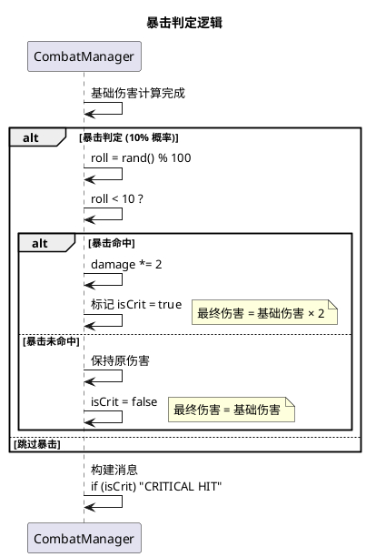
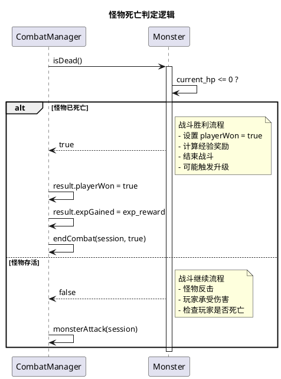
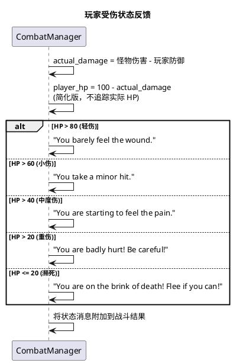
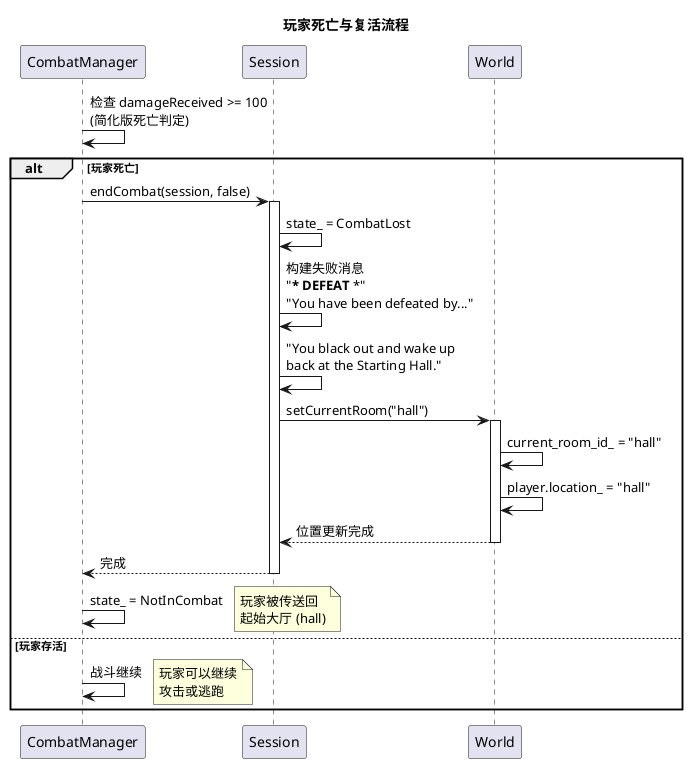
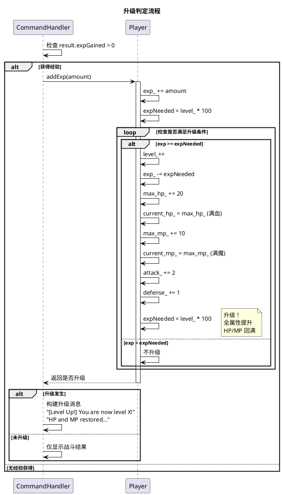
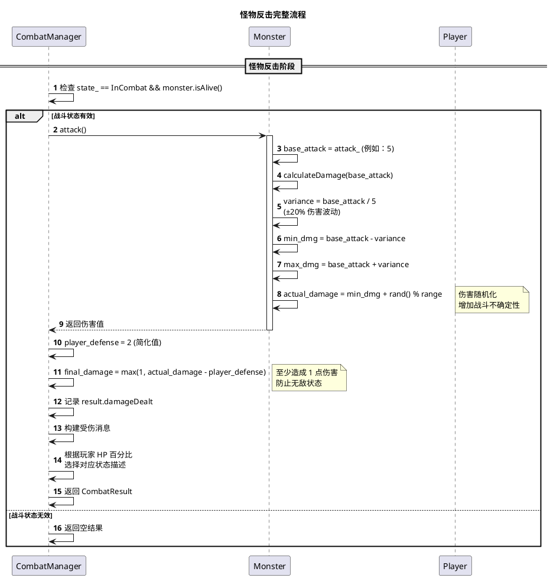
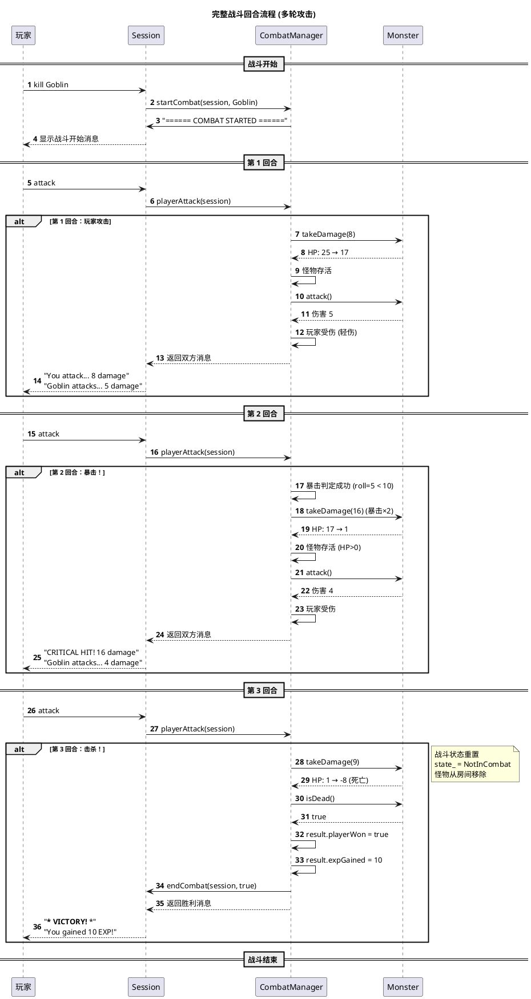
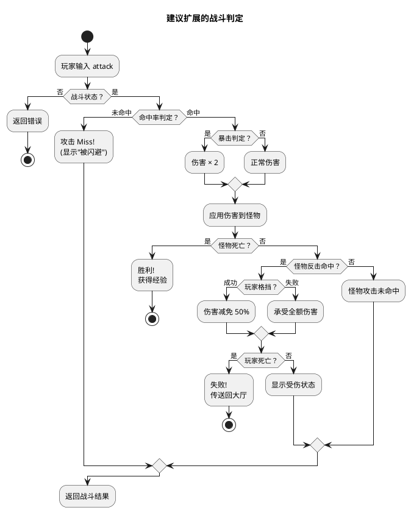

# MUD 游戏战斗攻击判定顺序图

**版本:** 1.0  
**日期:** 2026-04-01  
**依据:** 基于现有代码逆推 (Combat.cpp, Monster.cpp, Player.cpp)

---

## 1. 玩家攻击完整流程 (Sequence Diagram)

```plantuml
@startuml Player_Attack_Sequence_Diagram

title 玩家攻击判定完整流程

autonumber

participant "玩家" as Player
participant "Session" as Session
participant "CommandHandler" as CmdHandler
participant "CombatManager" as CombatMgr
participant "Monster" as Monster
participant "Player(HP)" as PlayerHP

== 阶段 1: 玩家输入攻击命令 ==

Player -> Session : 输入 "attack" 或 "kill <monster>"
Session -> CmdHandler : handleCommand(session, "attack")
CmdHandler -> CmdHandler : 解析命令，识别为 cmdAttack()

alt 检查战斗状态
    CmdHandler -> CombatMgr : isInCombat()
    CombatMgr --> CmdHandler : false
    CmdHandler --> Session : "You are not in combat..."
    Session --> Player : 返回错误消息
else 处于战斗状态
    CmdHandler -> CombatMgr : isInCombat()
    CombatMgr --> CmdHandler : true
    CmdHandler -> CombatMgr : playerAttack(session)
    
    == 阶段 2: 玩家攻击判定 ==
    
    activate CombatMgr
    
    CombatMgr -> CombatMgr : 检查 state_ == InCombat && monster.isAlive()
    
    alt 战斗状态无效
        CombatMgr --> CmdHandler : result.message = "Not in combat"
    else 战斗状态有效
        CombatMgr -> CombatMgr : 生成玩家攻击基数 (8 + rand() % 4)
        CombatMgr -> Monster : getDefense()
        Monster --> CombatMgr : 防御值 (例如：0)
        
        CombatMgr -> CombatMgr : 计算基础伤害\nmax(1, player_attack - defense/2)
        
        alt 暴击判定 (10% 概率)
            CombatMgr -> CombatMgr : rand() % 100 < 10
            CombatMgr -> CombatMgr : damage *= 2 (暴击！)
        else 普通命中
            CombatMgr -> CombatMgr : 保持原伤害
        end
        
        CombatMgr -> Monster : takeDamage(damage)
        activate Monster
        Monster -> Monster : actual_damage = max(1, damage - defense)\ncurrent_hp -= actual_damage
        Monster --> CombatMgr : 伤害已应用
        deactivate Monster
        
        CombatMgr -> CombatMgr : 记录 result.damageDealt
        CombatMgr -> CombatMgr : 构建攻击消息
        
        == 阶段 3: 检查怪物存活状态 ==
        
        CombatMgr -> Monster : isDead() (current_hp <= 0)
        
        alt 怪物死亡 (胜利)
            Monster --> CombatMgr : true
            CombatMgr -> CombatMgr : result.playerWon = true\nresult.expGained = exp_reward
            
            CombatMgr -> CombatMgr : 构建胜利消息
            
            CombatMgr -> Session : endCombat(session, true)
            activate Session
            
            Session -> Session : 获取当前房间
            Session -> Session : (可选) 从房间移除怪物
            Session --> CombatMgr : 完成
            
            CombatMgr -> CombatMgr : state_ = CombatWon → NotInCombat
            
            CombatMgr --> CmdHandler : result (含胜利消息)
            deactivate Session
            
        else 怪物存活 (继续战斗)
            Monster --> CombatMgr : false
            
            CombatMgr -> CombatMgr : 调用 monsterAttack(session)
            
            == 阶段 4: 怪物反击 ==
            
            CombatMgr -> CombatMgr : 检查战斗状态
            CombatMgr -> Monster : attack()
            activate Monster
            Monster -> Monster : calculateDamage(attack_)\nvariance = base_attack / 5\nreturn min_dmg + rand() % range
            Monster --> CombatMgr : 怪物伤害 (例如：5)
            deactivate Monster
            
            CombatMgr -> CombatMgr : 玩家防御减免\nactual_damage = max(1, damage - player_defense)
            
            CombatMgr -> PlayerHP : 计算虚拟 HP 状态\nplayer_hp = 100 - actual_damage
            
            alt 玩家 HP 状态分支
                player_hp > 80 : "You barely feel the wound."
                player_hp > 60 : "You take a minor hit."
                player_hp > 40 : "You are starting to feel the pain."
                player_hp > 20 : "You are badly hurt!"
                else : "You are on the brink of death!"
            end
            
            CombatMgr -> CombatMgr : 记录 result.damageReceived
            
            alt 玩家死亡判定 (简化版)
                damageReceived >= 100 : 玩家战败
                CombatMgr -> Session : endCombat(session, false)
                activate Session
                Session -> Session : state_ = CombatLost
                Session -> Session : 广播失败消息
                Session -> Session : setCurrentRoom("hall")\n(传送回起始大厅)
                Session --> CombatMgr : 完成
                deactivate Session
                CombatMgr -> CombatMgr : state_ = NotInCombat
            else 玩家存活
                CombatMgr -> CombatMgr : 战斗继续
            end
            
            CombatMgr --> CmdHandler : result (含双方消息)
        end
    end
    
    deactivate CombatMgr
    
    == 阶段 5: 返回结果给玩家 ==
    
    CmdHandler -> CmdHandler : 检查是否升级\nif expGained > 0: player.addExp()
    
    alt 升级发生
        CmdHandler -> PlayerHP : addExp(amount)
        activate PlayerHP
        PlayerHP -> PlayerHP : exp_ += amount
        PlayerHP -> PlayerHP : while exp >= level*100: level++\nmax_hp += 20, attack += 2...
        PlayerHP --> CmdHandler : 升级完成
        deactivate PlayerHP
        CmdHandler --> Session : 含升级消息
    else 无升级
        CmdHandler --> Session : 战斗结果消息
    end
    
    Session --> Player : 显示完整战斗结果
end

@enduml
```

---

## 2. 核心判定分支详解 (Alt 片段分解)

### 2.1 暴击判定分支



---

### 2.2 怪物存活判定分支



---

### 2.3 玩家受伤状态分支



---

### 2.4 玩家死亡/复活分支



---

### 2.5 升级判定分支



---

## 3. 怪物反击流程详解



---

## 4. 完整战斗回合时序 (多轮攻击)



---

## 5. 伤害计算公式汇总

### 5.1 玩家对怪物伤害

```
┌─────────────────────────────────────────────────────────┐
│  玩家伤害计算流程                                        │
├─────────────────────────────────────────────────────────┤
│  1. 基础攻击 = 8 + rand() % 4          (8-11 范围)      │
│                                                         │
│  2. 基础伤害 = max(1, 基础攻击 - 怪物防御/2)            │
│                                                         │
│  3. 暴击判定 = rand() % 100 < 10       (10% 概率)       │
│     - 是：最终伤害 = 基础伤害 × 2                       │
│     - 否：最终伤害 = 基础伤害                           │
│                                                         │
│  4. 怪物实际受伤 = max(1, 最终伤害 - 怪物防御)          │
│                                                         │
│  5. 怪物 HP = max(0, 当前 HP - 实际受伤)                │
└─────────────────────────────────────────────────────────┘
```

### 5.2 怪物对玩家伤害

```
┌─────────────────────────────────────────────────────────┐
│  怪物伤害计算流程                                        │
├─────────────────────────────────────────────────────────┤
│  1. 基础攻击 = 怪物.attack_ (根据难度等级)              │
│                                                         │
│  2. 伤害波动 = 基础攻击 / 5            (±20% 浮动)      │
│     最小伤害 = 基础攻击 - 波动                          │
│     最大伤害 = 基础攻击 + 波动                          │
│     实际攻击 = 最小伤害 + rand() % (范围)               │
│                                                         │
│  3. 玩家防御减免 = 2 (简化固定值)                       │
│                                                         │
│  4. 最终伤害 = max(1, 实际攻击 - 玩家防御)              │
│                                                         │
│  5. 玩家虚拟 HP = 100 - 最终伤害       (仅用于反馈)     │
└─────────────────────────────────────────────────────────┘
```

### 5.3 怪物难度属性对照

| 难度 | HP 范围 | 攻击范围 | 防御 | 经验 |
|------|---------|----------|------|------|
| Easy (哥布林/野狼) | 20-30 | 3-6 | 0 | 10 |
| Normal (骷髅战士) | 40-60 | 6-10 | 1 | 25 |
| Hard (兽人狂战士) | 80-110 | 10-15 | 2 | 50 |
| Boss (幼龙) | 150-200 | 15-23 | 4 | 150 |

---

## 6. 代码审查发现的问题

### 6.1 缺失的判定分支

| 问题 ID | 描述 | 当前状态 | 建议 |
|---------|------|----------|------|
| M-01 | **闪避判定** | ❌ 未实现 | 添加命中率/闪避率属性 |
| M-02 | **格挡/招架** | ❌ 未实现 | 添加防御动作选项 |
| M-03 | **玩家真实 HP 追踪** | ⚠️ 简化版 | 使用 Player.current_hp_ |
| M-04 | **多目标战斗** | ❌ 未实现 | 支持群体战斗 |
| M-05 | **技能/魔法攻击** | ❌ 未实现 | 添加技能系统 |

### 6.2 硬编码问题

```cpp
// Combat.cpp 中的硬编码
int player_attack = 8 + rand() % 4;  // ⚠️ 应使用 Player.attack_
int player_defense = 2;              // ⚠️ 应使用 Player.defense_
if (result.damageReceived >= 100)    // ⚠️ 应使用 Player.current_hp_ <= 0
```

### 6.3 建议的扩展判定



---

## 7. 总结

### 7.1 当前实现的判定分支

```
玩家攻击
├── 战斗状态检查 ✓
│   ├── 有效 → 继续
│   └── 无效 → 返回错误
│
├── 伤害计算 ✓
│   ├── 基础伤害 = 攻击 - 防御/2
│   └── 最小伤害 = 1
│
├── 暴击判定 ✓
│   ├── 成功 (10%) → 伤害 ×2
│   └── 失败 → 正常伤害
│
├── 怪物存活检查 ✓
│   ├── 死亡 → 胜利，获得经验
│   └── 存活 → 怪物反击
│
└── 怪物反击 ✓
    ├── 伤害计算 (±20% 波动)
    ├── 防御减免
    ├── 玩家状态反馈 (5 档 HP 状态)
    └── 玩家死亡检查 (简化版)
        ├── 死亡 → 传送回大厅
        └── 存活 → 战斗继续
```

### 7.2 建议优先实现的功能

| 优先级 | 功能 | 理由 |
|--------|------|------|
| P0 | 使用 Player 真实 HP | 修复当前简化版逻辑 |
| P0 | 移除硬编码属性 | 提高代码可维护性 |
| P1 | 闪避/命中判定 | 增加战斗策略性 |
| P1 | 防御动作 (格挡/招架) | 增加玩家选择 |
| P2 | 技能系统 | 丰富战斗玩法 |

---

**文档版本历史:**

| 版本 | 日期 | 变更说明 |
|------|------|----------|
| 1.0 | 2026-04-01 | 基于现有代码逆推初始版本 |

```mermaid

sequenceDiagram
    autonumber
    title 玩家攻击判定完整流程

    participant Player as 玩家
    participant Session
    participant CmdHandler as CommandHandler
    participant CombatMgr as CombatManager
    participant Monster
    participant PlayerHP as PlayerHP

    Note over Player,Session: 阶段 1: 玩家输入攻击命令

    Player->>Session: 输入 "attack" 或 "kill <monster>"
    Session->>CmdHandler: handleCommand(session, "attack")
    CmdHandler->>CmdHandler: 解析命令，识别为 cmdAttack()

    alt 检查战斗状态
        CmdHandler->>CombatMgr: isInCombat()
        CombatMgr-->>CmdHandler: false
        CmdHandler-->>Session: You are not in combat...
        Session-->>Player: 返回错误消息
    else 处于战斗状态
        CmdHandler->>CombatMgr: isInCombat()
        CombatMgr-->>CmdHandler: true
        CmdHandler->>CombatMgr: playerAttack(session)
    end

    Note over CombatMgr,Monster: 阶段 2: 玩家攻击判定

    activate CombatMgr
    CombatMgr->>CombatMgr: 检查战斗状态有效性

    alt 战斗状态无效
        CombatMgr-->>CmdHandler: Not in combat
    else 战斗状态有效
        CombatMgr->>CombatMgr: 生成玩家攻击基数
        CombatMgr->>Monster: getDefense()
        Monster-->>CombatMgr: 防御值
        CombatMgr->>CombatMgr: 计算基础伤害
        
        alt 暴击判定
            CombatMgr->>CombatMgr: 10%概率判定
            CombatMgr->>CombatMgr: damage *= 2
            Note right of CombatMgr: 暴击！伤害翻倍
        else 普通命中
            CombatMgr->>CombatMgr: 保持原伤害
        end
        
        CombatMgr->>Monster: takeDamage(damage)
        activate Monster
        Monster->>Monster: 扣除生命值
        Monster-->>CombatMgr: 伤害已应用
        deactivate Monster
    end

    Note over CombatMgr,Session: 阶段 3: 检查怪物存活状态

    CombatMgr->>Monster: isDead()
    
    alt 怪物死亡
        Monster-->>CombatMgr: true
        CombatMgr->>CombatMgr: 计算经验奖励
        CombatMgr->>Session: endCombat(session, true)
        activate Session
        Session->>Session: 从房间移除怪物
        Session-->>CombatMgr: 完成
        deactivate Session
        CombatMgr->>CombatMgr: 重置战斗状态
        CombatMgr-->>CmdHandler: 返回胜利结果
    else 怪物存活
        Monster-->>CombatMgr: false
        CombatMgr->>CombatMgr: 调用怪物反击
        
        Note over CombatMgr,PlayerHP: 阶段 4: 怪物反击
        
        CombatMgr->>Monster: attack()
        activate Monster
        Monster->>Monster: 计算伤害值
        Monster-->>CombatMgr: 怪物伤害
        deactivate Monster
        
        CombatMgr->>CombatMgr: 玩家防御减免
        CombatMgr->>PlayerHP: 计算剩余血量
        
        alt 高血量状态
            PlayerHP-->>CombatMgr: HP > 80%
            CombatMgr->>CombatMgr: You barely feel the wound.
        else 中等血量状态
            PlayerHP-->>CombatMgr: HP > 60%
            CombatMgr->>CombatMgr: You take a minor hit.
        else 较低血量状态
            PlayerHP-->>CombatMgr: HP > 40%
            CombatMgr->>CombatMgr: You are starting to feel the pain.
        else 低血量状态
            PlayerHP-->>CombatMgr: HP > 20%
            CombatMgr->>CombatMgr: You are badly hurt!
        else 濒死状态
            PlayerHP-->>CombatMgr: HP <= 20%
            CombatMgr->>CombatMgr: You are on the brink of death!
        end
        
        alt 玩家死亡
            CombatMgr->>CombatMgr: 判定玩家死亡
            CombatMgr->>Session: endCombat(session, false)
            activate Session
            Session->>Session: 传送回起始大厅
            Session->>Session: 广播失败消息
            Session-->>CombatMgr: 完成
            deactivate Session
            CombatMgr->>CombatMgr: 重置战斗状态
        else 玩家存活
            CombatMgr->>CombatMgr: 战斗继续
        end
        
        CombatMgr-->>CmdHandler: 返回战斗结果
    end
    
    deactivate CombatMgr

    Note over CmdHandler,Player: 阶段 5: 返回结果给玩家

    CmdHandler->>CmdHandler: 检查是否升级
    
    alt 升级发生
        CmdHandler->>PlayerHP: addExp(amount)
        activate PlayerHP
        PlayerHP->>PlayerHP: 增加经验值
        PlayerHP->>PlayerHP: 检查升级条件
        PlayerHP->>PlayerHP: 提升等级和属性
        PlayerHP-->>CmdHandler: 升级完成
        deactivate PlayerHP
        CmdHandler-->>Session: 返回升级消息
    else 无升级
        CmdHandler-->>Session: 返回战斗结果消息
    end
    
    Session-->>Player: 显示完整战斗结果
```



